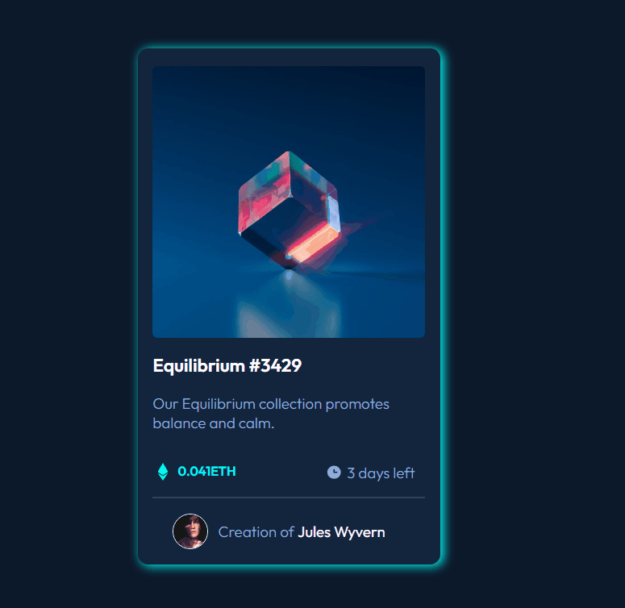

<h1 align="center">NFT Preview Card</h1>

  Página responsiva de um cartão NFT, feita para praticar front-end moderno com HTML5 e CSS3.  
  Inspirado em desafios do Frontend Mentor 🚀

  
  📸 <strong>Preview</strong>:
  
  

    
  
  🎞️ <strong>GIF demonstrativo</strong>:
  
  

---

## 🚀 Tecnologias

● HTML5

● CSS3

● Flexbox

● Variáveis CSS

● Animações de Hover

● Estrutura de pastas organizada

---

## 📁 Estrutura do projeto

nft/➟ index.html➟ src/ ➟ css/ ➟ │reset.css│ ➟ │ style.css│ ➟ │variables.css│ ➟ img/

---

## 📌 Como visualizar

● Clone este repositório:
   
bash
   git clone https://github.com/Daniel-Ladams/nft.git
Acesse a pasta do projeto:

● bash
● Copiar
● Editar
● cd nft
● Abra o arquivo index.html no navegador.

📄 Licença
Este projeto está aberto para estudo, uso e melhoria. Fique à vontade para forkar ⭐

Feito por <a href="https://github.com/Daniel-Ladams" target="_blank">Daniel Adams</a>

